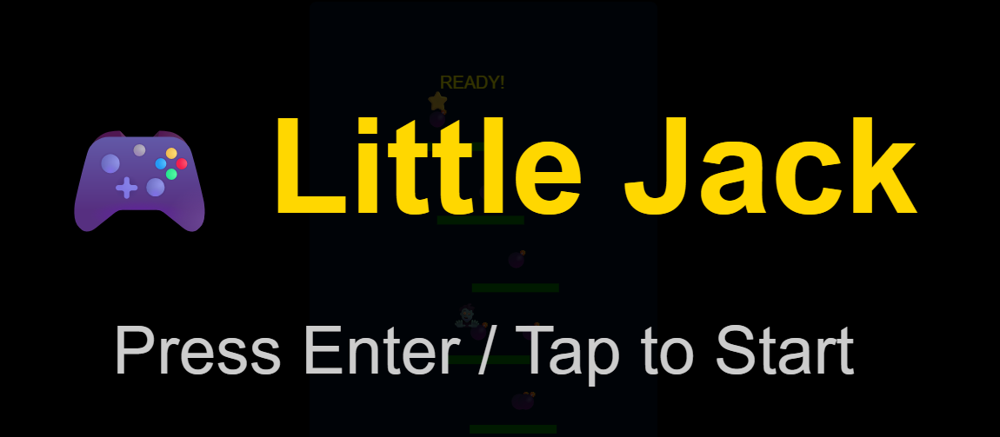
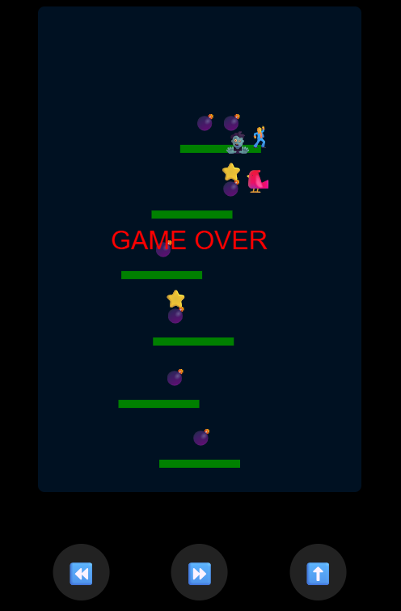

Fully HTML 5 Self Contained Game (One file)
# 🎮 Little Jack  

A simple retro-style platformer inspired by **Bomb Jack**, built entirely with **HTML, CSS, and JavaScript**.  
Play as 🕺 Jack, collect 💣 bombs, grab ⭐ power-ups, dodge 👾 enemies, and survive as long as you can!  

---

## 🚀 Features
- 🕹️ Touch controls for mobile + keyboard support for desktop  
- 💣 Bombs always spawn **on platforms** (no impossible levels)  
- ⭐ **Double Jump power-up** for extra mobility  
- ❤️ Random **extra life drops** each level (max 5 lives)  
- 🎵 Built-in chiptune-like **sound effects & theme music** (no external assets)  
- 🔄 Pause, Restart, Exit menus  
- 🐢 Slower movement + 🍃 floatier jumps for smooth control  
- ⏸️ Level transitions with a **“READY!”** banner  

---

## 🎯 Controls

### Keyboard
- ⬅️ `Arrow Left` → Move left  
- ➡️ `Arrow Right` → Move right  
- ⬆️ / `Space` → Jump (double jump if ⭐ active)  
- `M` → Toggle music  
- `P` → Pause  
- `R` → Restart menu  
- `Esc` → Exit  

### Mobile
- ⏪ Button → Move left  
- ⏩ Button → Move right  
- ⬆️ Button → Jump  

---

## 🧩 How to Run
1. Clone this repository or copy the HTML file.  
2. Save it as `index.html`.  
3. Open in any modern browser (desktop or mobile).  
   - No build step required.  
   - No external dependencies.  

---

## 📷 Screenshots  

### Start Screen
```
🎮 Little Jack
Press Enter / Tap to Start
```

### Gameplay
- Collect 💣 bombs  
- Avoid 👾 enemies  
- Grab ⭐ for double jump  
- Pick up ❤️ for extra life  

### Game Over
```
GAME OVER
```

---

## 🛠️ Code Highlights
- Pure **Canvas 2D rendering**  
- Procedural **platform + enemy generation**  
- In-browser **Web Audio API** for retro sound effects  
- No external sprites — uses **emoji graphics**
- 
---

## 🧑‍💻 Developers
**Author:** Mike Williams  
**Engine:** Pure JavaScript / Canvas / WebAudio  
**Compatibility:** Any modern browser  
**Purpose:** Stand-alone retro game demo & HTML5 teaching example  

---

## 📜 License
This game is called **Little Jack** to avoid confusion with the original *Bomb Jack*.  
It is a fun learning/demo project and not affiliated with Tecmo (original creators).  

MIT License © 2025  
